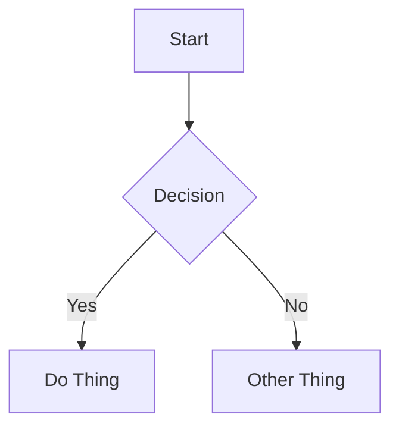

# Astro Content Format Reference

## Platform Info

| Property | Value |
|----------|-------|
| Platform | Astro (Content Collections) |
| Content directory | `src/content/blog/` |
| Common subdirectories | Usually flat within the blog collection |
| File naming | Slug: `my-post-title.md` (or `.mdx` for MDX) |
| Frontmatter format | YAML between `---` delimiters |
| Draft behavior | `draft: true` - filtering depends on collection schema |

**Note:** Astro uses content collections with typed schemas defined in `src/content/config.ts`. The exact required fields depend on your schema definition, but the conventions below are standard.

## Frontmatter

### Required Fields (by convention)

| Field | Type | Description |
|-------|------|-------------|
| `title` | string | Post title. Displayed as page heading. |
| `pubDate` | date | Publication date in `YYYY-MM-DD` or ISO format. |

### Optional Fields

| Field | Type | Description |
|-------|------|-------------|
| `description` | string | Short summary (1-2 sentences). Important for SEO as Astro doesn't auto-generate excerpts. |
| `updatedDate` | date | Last modified date. Use when updating published posts. |
| `heroImage` | string | Path to header image (common pattern for post headers). |
| `tags` | list | Array of tag strings for categorization. |
| `draft` | boolean | If `true`, typically filtered from listings. |
| `author` | string | Post author name. |

### Full Example

```yaml
---
title: "Building a CLI Tool in Go"
description: "A step-by-step guide to creating your first command-line application with Go."
pubDate: 2025-01-15
updatedDate: 2025-01-20
heroImage: "/images/go-cli-hero.jpg"
tags:
  - go
  - cli
  - tutorial
draft: false
author: "Brenna"
---
```

## Content Features

### Callouts / Admonitions

**NOT natively supported in base Astro markdown.**

If you're using **Starlight** (Astro's docs theme), it supports these callout types:

```markdown
:::note
Content of the note callout.
:::

:::tip
Content of the tip callout.
:::

:::caution
Content of the caution callout.
:::

:::danger
Content of the danger callout.
:::
```

For standard Astro blogs without Starlight, use regular emphasized text or blockquotes:

```markdown
> **Note:** This is an important point to remember.

**Tip:** You can also use bold text for emphasis.
```

### Code Blocks

Astro uses **Shiki** for syntax highlighting (built-in, excellent quality).

**Basic syntax highlighting:**

````markdown
```python
def hello():
    print("Hello, world!")
```
````

**Title** - add `title="filename"`:

````markdown
```python title="app.py"
def main():
    print("Running app")
```
````

**Line highlighting** - `{N}` or `{N-M}`:

````markdown
```python {2-3}
def process():
    x = calculate()  # highlighted
    return x          # highlighted
```
````

**Mark/ins/del highlighting** - for diff-style highlighting:

````markdown
```python mark={1} ins={2} del={3}
normal_line = "unchanged"
new_line = "added"
old_line = "removed"
```
````

**Line wrapping** - add `wrap` attribute:

````markdown
```python wrap
very_long_line_of_code_that_would_normally_overflow_the_container()
```
````

### Internal Links

Standard markdown links with relative or absolute paths:

```markdown
[Link to other post](/blog/other-post)
[Relative link](../other-post)
```

**No wikilink support** - use standard markdown syntax.

In MDX files, you can use Astro components for enhanced linking:

```mdx
import { getEntry } from 'astro:content';
<a href="/blog/other-post">Custom Link</a>
```

### Images

**Standard markdown** (recommended for simple use):

```markdown


```

**Image locations:**
- `src/` - images optimized by Astro's image service at build time
- `public/images/` - served as-is, good for blog post images

**In MDX** (for optimized images):

```mdx
---
import { Image } from 'astro:assets';
import heroImage from './hero.jpg';
---

<Image src={heroImage} alt="Description" />
<Image src="/images/photo.jpg" alt="Description" width={800} height={600} />
```

**Best practices:**
- Always include alt text
- Use descriptive filenames: `authentication-flow-diagram.png` over `IMG_4523.png`
- Prefer `public/images/` for markdown posts or co-located images with relative paths
- For MDX, use the `<Image>` component for automatic optimization
- No wikilink image syntax

### Video Embeds

Use HTML iframes (work in both markdown and MDX):

```html
<iframe width="560" height="315" src="https://www.youtube.com/embed/VIDEO_ID" title="Video title" frameborder="0" allowfullscreen></iframe>
```

Always add a context sentence before the embed and a fallback link after:

```markdown
[Watch on YouTube](https://www.youtube.com/watch?v=VIDEO_ID)
```

MDX files can use custom components for video embeds:

```mdx
<VideoEmbed id="VIDEO_ID" platform="youtube" />
```

### Diagrams (Mermaid)

**NOT natively supported** - requires `remark-mermaid` or client-side JS.

If you have Mermaid configured in your Astro project, use standard fenced code blocks:

````markdown

````

If unsure whether Mermaid is set up, skip diagrams or use images instead.

### Math (LaTeX)

**NOT natively supported** - requires `remark-math` + `rehype-katex` remark plugins.

If you have math support configured, use standard LaTeX syntax:

Inline: `$E = mc^2$`

Display:

```markdown
$$
\int_{0}^{\infty} e^{-x^2} dx = \frac{\sqrt{\pi}}{2}
$$
```

If unsure whether math support is set up, skip LaTeX or use images instead.

## Content Structure Best Practices

1. **Start with context** - open with a brief paragraph explaining what the post covers and why it matters.
2. **Use h2 for major sections** - keep the heading hierarchy clean (h2 → h3 → h4).
3. **One idea per paragraph** - keep paragraphs focused and scannable.
4. **Code with context** - explain what code does before or after the block. Always include the language identifier.
5. **Use callouts sparingly** (if available) - most effective for tips, warnings, and important asides, not regular content.
6. **End with a takeaway** - close with a summary, next steps, or a call to action.
7. **Tags for discoverability** - use 2-5 relevant tags. Prefer existing tags over creating new ones.
8. **Descriptions matter** - write a compelling 1-2 sentence description. Unlike some platforms, Astro doesn't auto-generate excerpts, so the `description` field is crucial for SEO and post listings.
9. **Hero images enhance engagement** - if your theme supports `heroImage`, use high-quality header images to make posts more visually appealing.
10. **Content collections provide type safety** - stick to the fields defined in your schema. Check `src/content/config.ts` if you're unsure what fields are required or optional.
