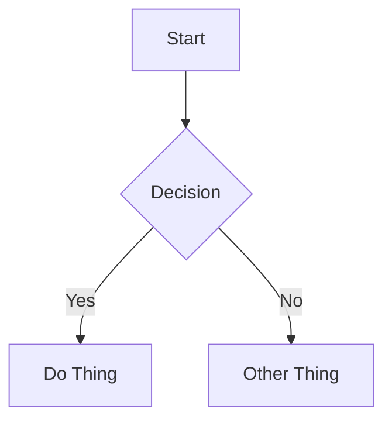

# Docusaurus Content Format Reference

## Platform Info

| Property | Value |
|----------|-------|
| Platform | Docusaurus |
| Content directory | `blog/` for blog posts |
| Common subdirectories | Usually flat, or organized with date-prefixed folders |
| File naming | Slug: `my-post-title.md` or `my-post-title.mdx`, date-prefixed: `2025-01-15-my-post-title.md`, or folder: `2025-01-15-my-post/index.md` |
| Frontmatter format | YAML between `---` delimiters |
| Draft behavior | `draft: true` — hidden in production, visible in development |
| Note | Docusaurus supports both markdown and MDX out of the box |

## Frontmatter

### Required Fields

| Field | Type | Description |
|-------|------|-------------|
| `title` | string | Post title. Displayed as page heading. |

### Optional Fields

| Field | Type | Description |
|-------|------|-------------|
| `description` | string | Short summary. Used for blog post summary on list page and SEO. |
| `slug` | string | Controls the URL path. If omitted, derived from filename. |
| `date` | date | Publication date in `YYYY-MM-DD` format. |
| `tags` | list | Array of tag strings for categorization. Can also be objects with `label` and `permalink`. |
| `authors` | object or list | Author metadata. Can be rich object `{name, title, url, image_url}` or reference to `authors.yml`. Preferred over `author` field. |
| `hide_table_of_contents` | boolean | If `true`, hides the table of contents for this post. |
| `draft` | boolean | If `true`, hidden in production but visible in development. |
| `last_update` | object | Last update information. Format: `{date: YYYY-MM-DD, author: Name}`. |

### Full Example

```yaml
---
title: "Building a CLI Tool in Go"
description: "A step-by-step guide to creating your first command-line application with Go."
date: 2025-01-15
tags:
  - go
  - cli
  - tutorial
authors:
  name: Brenna
  title: Software Engineer
  url: https://github.com/brenna
  image_url: /img/avatar.png
draft: false
last_update:
  date: 2025-03-15
  author: Brenna
---
```

## Content Features

### Callouts / Admonitions

**Natively supported!** Docusaurus uses `:::` container syntax for admonitions.

**Available types:** `note`, `tip`, `info`, `warning`, `danger`

```markdown
:::note
Content of the note.
:::

:::tip
Content of the tip.
:::

:::info
Informational content.
:::

:::warning
Warning content.
:::

:::danger
Dangerous content here.
:::
```

**Custom titles** — add title in square brackets after the type:

```markdown
:::tip[My Custom Title]
Content of the tip with a custom title.
:::

:::note[Important Context]
This note has a custom heading.
:::
```

### Code Blocks

**Basic syntax highlighting** — Prism by default:

````markdown
```python
def hello():
    print("Hello, world!")
```
````

**Title** — add `title="filename"`:

````markdown
```python title="app.py"
def main():
    print("Running app")
```
````

**Line highlighting** — `{N}` or `{N-M}` after language:

````markdown
```python {2-3}
def process():
    x = calculate()  # highlighted
    return x          # highlighted
```
````

**Magic comments** — inline highlighting directives:

````markdown
```python
def example():
    # highlight-next-line
    important_line()
    # highlight-start
    block_start()
    block_end()
    # highlight-end
```
````

**Line numbers** — add `showLineNumbers` attribute:

````markdown
```js title="app.js" {1,3-4} showLineNumbers
function greet() {
    console.log("Hello");
    return true;
}
```
````

### Internal Links

Docusaurus supports standard markdown links:

```markdown
[Link Text](/blog/other-post)
[Link Text](./other-post.md)
```

File paths with `.md` extension also work for blog post links.

**Note:** Docusaurus does not support wikilinks.

### Images

**Standard markdown** — relative or absolute paths:

```markdown


```

**Image locations:**
- Co-located with blog post: `./img/my-image.png`
- In static directory: `/img/my-image.png` (served from `static/img/`)

**MDX files** — can use HTML `` tags or custom React components:

```jsx

```

**Best practices:**
- Always include alt text
- Use descriptive filenames: `authentication-flow-diagram.png` over `IMG_4523.png`
- Prefer local images stored in your media directory
- Use `static/img/` for shared images across multiple posts
- Co-locate images with posts for better organization

**Note:** Docusaurus does not support wikilink image syntax.

### Video Embeds

Use HTML iframes in both markdown and MDX:

```html
<iframe width="560" height="315" src="https://www.youtube.com/embed/VIDEO_ID" title="Video title" frameborder="0" allowfullscreen></iframe>
```

Always add a context sentence before the embed and a fallback link after:

```markdown
[Watch on YouTube](https://www.youtube.com/watch?v=VIDEO_ID)
```

**Note:** MDX files can use custom React components for more sophisticated video embeds.

### Diagrams (Mermaid)

**Supported via official plugin** `@docusaurus/theme-mermaid`.

When enabled, use standard fenced `mermaid` code blocks:

````markdown

````

Supports flowcharts, sequence diagrams, class diagrams, state diagrams, gantt charts, and gitgraph.

**Important:** Mermaid support must be enabled in `docusaurus.config.js`. If unsure whether the user has it configured, ask before using Mermaid diagrams.

### Math (LaTeX)

**Supported via official plugins** `remark-math` + `rehype-katex`.

When enabled:

Inline: `$E = mc^2$`

Display:

```markdown
$$
\int_{0}^{\infty} e^{-x^2} dx = \frac{\sqrt{\pi}}{2}
$$
```

**Important:** LaTeX support must be enabled in `docusaurus.config.js`. If unsure whether the user has it configured, ask before using LaTeX math.

## Content Structure Best Practices

1. **Start with context** — open with a brief paragraph explaining what the post covers and why it matters.
2. **Use h2 for major sections** — keep the heading hierarchy clean (h2 → h3 → h4).
3. **One idea per paragraph** — keep paragraphs focused and scannable.
4. **Code with context** — explain what code does before or after the block. Always include the language identifier.
5. **Use admonitions effectively** — the `:::` syntax is a core Docusaurus feature. Use it for tips, warnings, important notes, and contextual information.
6. **Use the truncate marker** — add `<!--truncate-->` in your post to control what shows on the blog list page. Content before this marker appears in the preview.
7. **End with a takeaway** — close with a summary, next steps, or a call to action.
8. **Tags for discoverability** — use 2-5 relevant tags. Prefer existing tags over creating new ones.
9. **Descriptions matter** — write a compelling 1-2 sentence description. This appears in blog post listings and is used for SEO.
10. **Authors field for consistency** — use the `authors` field with `authors.yml` for consistent author information across all posts.
11. **MDX for interactivity** — Docusaurus supports MDX out of the box, so you can use React components when needed, but stick to plain markdown for better portability.
