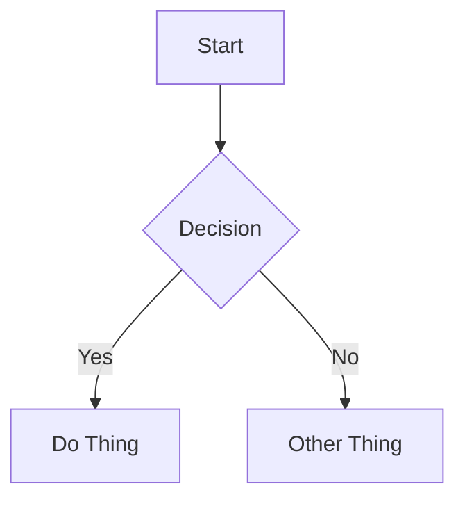

# Eleventy (11ty) Content Format Reference

## Platform Info

| Property | Value |
|----------|-------|
| Platform | Eleventy (11ty) |
| Content directory | Highly configurable — common patterns: `src/posts/`, `src/blog/`, `content/`, `posts/` |
| Common subdirectories | Usually flat within the posts directory |
| File naming | Slug: `my-post-title.md` |
| Frontmatter format | YAML between `---` delimiters (also supports JSON frontmatter) |
| Draft behavior | `draft: true` in frontmatter — requires custom filtering in collection (common pattern, but user must configure it) |

**Note:** Eleventy is extremely flexible and unopinionated. Conventions vary widely per project. When in doubt, follow what existing posts in the project do.

## Frontmatter

### Required Fields (by convention)

| Field | Type | Description |
|-------|------|-------------|
| `title` | string | Post title. Displayed as page heading. |
| `date` | date | Publication date. Standard format: `YYYY-MM-DD`. Also supports special values: `Last Modified`, `Created`, `git Last Modified`, `git Created`. |

### Optional Fields

| Field | Type | Description |
|-------|------|-------------|
| `description` | string | Short summary (1-2 sentences). Used in previews and SEO. |
| `tags` | list | Array of tag strings. Used for collections AND display tags. Common pattern: include `posts` tag to add to posts collection. |
| `layout` | string | Template name to wrap content (e.g., `post`, `base`). |
| `draft` | boolean | If `true`, hidden from listings (requires custom filtering in collection). |
| `author` | string | Post author name. |
| `permalink` | string | Custom permanent URL path for the page. |
| `eleventyExcludeFromCollections` | boolean | Exclude from all collections if `true`. |

### Full Example

```yaml
---
title: "Building a CLI Tool in Go"
description: "A step-by-step guide to creating your first command-line application with Go."
date: 2025-01-15
tags:
  - posts
  - go
  - cli
  - tutorial
layout: post
draft: false
author: "Brenna"
---
```

## Content Features

### Callouts / Admonitions

**NOT natively supported.**

Would require a custom markdown plugin or paired shortcode. Do not use callout syntax — write important information as regular emphasized text or blockquotes instead.

```markdown
> **Important:** This is a key point to remember.

**Note:** Standard emphasis works for highlighting key information.
```

### Code Blocks

**Basic syntax highlighting:**

Eleventy supports syntax highlighting via the `@11ty/eleventy-plugin-syntaxhighlight` plugin (uses Prism by default). Shiki is also an option.

````markdown
```python
def hello():
    print("Hello, world!")
```
````

**Title:** NOT natively supported in fenced code blocks. Implementation varies by project.

**Line highlighting:** Supported via Prism plugin's `//` comment markers or line range syntax, but implementation varies by project.

````markdown
```python
def process():
    x = calculate()  # [!code highlight]
    return x
```
````

**Standard fenced code blocks are the reliable baseline.** Always include the language identifier.

### Internal Links

Standard markdown links:

```markdown
[Link Text](/blog/other-post/)
```

**Important:** Permalink structure is user-configured, so link paths depend on the project's permalink settings. Check existing posts for the correct pattern.

No wikilink support unless added via plugin.

### Images

**Standard markdown:**

```markdown

```

**Images typically live in a top-level directory** like `img/`, `images/`, or `assets/img/`.

**Eleventy Image plugin** (`@11ty/eleventy-img`) provides optimization and responsive images, but requires shortcodes. Don't assume it's available.

**Best practices:**
- Always include alt text
- Use descriptive filenames: `authentication-flow-diagram.png` over `IMG_4523.png`
- Prefer local images stored in the project's image directory
- No wikilink image syntax
- No built-in figure/caption shortcode

### Video Embeds

Use HTML iframes:

```html
<iframe width="560" height="315" src="https://www.youtube.com/embed/VIDEO_ID" title="Video title" frameborder="0" allowfullscreen></iframe>
```

Always add a context sentence before the embed and a fallback link after:

```markdown
[Watch on YouTube](https://www.youtube.com/watch?v=VIDEO_ID)
```

**No built-in shortcodes for video.** Custom paired shortcodes can be defined per-project, but don't assume they exist.

### Diagrams (Mermaid)

**NOT natively supported** — requires client-side JavaScript or a plugin.

If the user has Mermaid set up, use standard fenced `mermaid` code blocks:

````markdown

````

If unsure whether Mermaid is available, skip Mermaid diagrams.

### Math (LaTeX)

**NOT natively supported** — requires adding KaTeX or MathJax to the project.

If the user's site supports it, use standard syntax:

Inline: `$E = mc^2$`

Display:

```markdown
$$
\int_{0}^{\infty} e^{-x^2} dx = \frac{\sqrt{\pi}}{2}
$$
```

If unsure whether LaTeX is available, skip LaTeX formatting.

## Content Structure Best Practices

1. **Start with context** — open with a brief paragraph explaining what the post covers and why it matters.
2. **Use h2 for major sections** — keep the heading hierarchy clean (h2 → h3 → h4).
3. **One idea per paragraph** — keep paragraphs focused and scannable.
4. **Code with context** — explain what code does before or after the block. Always include the language identifier.
5. **End with a takeaway** — close with a summary, next steps, or a call to action.
6. **Tags for collections** — the `tags` field in Eleventy serves double duty: used for collections AND display tags. The user likely has a tag like `posts` or `blog` that adds content to the blog collection. Ask about this during setup.
7. **Descriptions matter** — write a compelling 1-2 sentence `description` or `excerpt` for post listings and link previews.
8. **Follow project conventions** — Eleventy is highly flexible. When in doubt about a convention, follow what existing posts in the project do.
