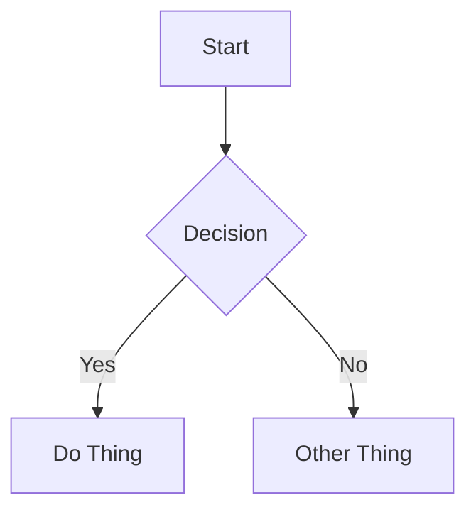

# Hugo Content Format Reference

## Platform Info

| Property | Value |
|----------|-------|
| Platform | Hugo |
| Content directory | `content/` |
| Common subdirectories | `posts/`, `blog/`, `articles/` |
| File naming | Slug: `my-post-title.md` |
| Frontmatter format | YAML between `---` delimiters (YAML is most common; TOML and JSON also supported) |
| Draft behavior | `draft: true` - hidden from build output unless `--buildDrafts` flag is used |

## Frontmatter

### Required Fields

| Field | Type | Description |
|-------|------|-------------|
| `title` | string | Post title. Displayed as page heading. |
| `date` | date | Publication date in `YYYY-MM-DD` or RFC3339 format. |

### Optional Fields

| Field | Type | Description |
|-------|------|-------------|
| `description` | string | Short summary (1-2 sentences). Used in previews and SEO. |
| `tags` | list | Array of tag strings for categorization. Built-in taxonomy. |
| `categories` | list | Array of category strings. Built-in taxonomy. |
| `draft` | boolean | If `true`, hidden from build unless `--buildDrafts` flag is used. |
| `author` | string | Post author name. |
| `lastmod` | date | Last modified date. Use when updating published posts. |
| `slug` | string | Custom URL slug (overrides filename). |
| `url` | string | Custom permanent URL path for the page. |
| `summary` | string | Content summary for list pages. If not set, Hugo uses content before `<!--more-->`. |
| `aliases` | list | Alternative URL paths that redirect to this page. |
| `series` | list | Group related posts into a series. |
| `weight` | integer | Order posts (lower weight = higher priority). |
| `images` | list | URLs for social sharing and OpenGraph metadata. |

### Full Example

```yaml
---
title: "Building a CLI Tool in Go"
description: "A step-by-step guide to creating your first command-line application with Go."
date: 2025-01-15
tags:
  - go
  - cli
  - tutorial
categories:
  - development
draft: false
author: "Brenna"
summary: "Learn how to build a production-ready CLI tool using Go's standard library and popular third-party packages."
---
```

## Content Features

### Callouts / Admonitions

**NOT natively supported** in base Hugo. Many themes add custom shortcodes for admonitions, but there is no standard syntax.

Use regular emphasized text or blockquotes for important information:

```markdown
**Note:** This is important information.

> **Tip:** This is a helpful tip formatted as a blockquote.
```

### Code Blocks

**Basic syntax highlighting:**

````markdown
```python
def hello():
    print("Hello, world!")
```
````

**Title** - NOT natively supported in standard fenced code blocks. Some themes add custom support, but avoid relying on it.

**Line highlighting** - use `{hl_lines=[1,3]}` or `{hl_lines=["2-4"]}`:

````markdown
```python {hl_lines=[2,3]}
def process():
    x = calculate()  # highlighted
    return x          # highlighted
```
````

**Line numbers** - use `{linenos=true}`:

````markdown
```python {linenos=true}
def main():
    print("Running app")
```
````

**Custom start line** - use `{linenostart=10}`:

````markdown
```python {linenos=true,linenostart=10}
def function():
    pass
```
````

**Hugo highlight shortcode** (alternative syntax):

```markdown

def hello():
    name = "world"  # highlighted
    print(f"Hello, {name}!")

```

### Internal Links

Standard markdown links with relative paths:

```markdown
[Link Text](/posts/other-post/)
[Link Text](../other-post/)
```

**Hugo ref/relref shortcodes** (validates links at build time):

```markdown
[Link Text]()
[Link Text]()
[Link to heading]()
```

**Best practices:**
- Use `ref`/`relref` for internal links when possible - Hugo will error if the target doesn't exist
- Relative paths work but won't be validated at build time

### Images

**Standard markdown:**

```markdown


```

**Hugo figure shortcode** (for captions and additional attributes):

```markdown


```

**Best practices:**
- Always include alt text
- Use descriptive filenames: `authentication-flow-diagram.png` over `IMG_4523.png`
- Images typically live in `static/images/` (served at `/images/`)
- Or use page bundles: create `content/posts/my-post/` with `index.md` and images
- No wikilink syntax support - use standard markdown or shortcodes

### Video Embeds

**HTML iframes:**

```html
<iframe width="560" height="315" src="https://www.youtube.com/embed/VIDEO_ID" title="Video title" frameborder="0" allowfullscreen></iframe>
```

**Hugo built-in shortcodes:**

```markdown


```

Always add a context sentence before the embed and a fallback link after:

```markdown
This tutorial walks through the entire setup process:



[Watch on YouTube](https://www.youtube.com/watch?v=dQw4w9WgXcQ)
```

### Diagrams (Mermaid)

**NOT natively supported** - requires adding mermaid.js via partial template or shortcode.

Many popular Hugo themes include Mermaid support. If your site supports it, use standard fenced code blocks:

````markdown

````

**If unsure whether your site supports Mermaid, skip diagrams or use static images instead.**

### Math (LaTeX)

**NOT natively supported** - requires adding KaTeX or MathJax via partial template.

If your site supports math rendering, use standard LaTeX syntax:

Inline: `$E = mc^2$`

Display:

```markdown
$$
\int_{0}^{\infty} e^{-x^2} dx = \frac{\sqrt{\pi}}{2}
$$
```

**If unsure whether your site supports math, avoid LaTeX syntax.**

## Content Structure Best Practices

1. **Start with context** - open with a brief paragraph explaining what the post covers and why it matters.
2. **Use h2 for major sections** - keep the heading hierarchy clean (h2 → h3 → h4).
3. **One idea per paragraph** - keep paragraphs focused and scannable.
4. **Code with context** - explain what code does before or after the block. Always include the language identifier.
5. **Use blockquotes for emphasis** - since callouts aren't standard, use blockquotes for important asides.
6. **Control post previews** - use `summary` frontmatter or add `<!--more-->` divider to control what appears on list pages.
7. **End with a takeaway** - close with a summary, next steps, or a call to action.
8. **Tags for discoverability** - use 2-5 relevant tags. Prefer existing tags over creating new ones. Hugo generates tag pages automatically.
9. **Descriptions matter** - write a compelling 1-2 sentence description for post listings and link previews.
10. **Leverage taxonomies** - use both `tags` and `categories` consistently. Hugo's taxonomy system is powerful and flexible.
