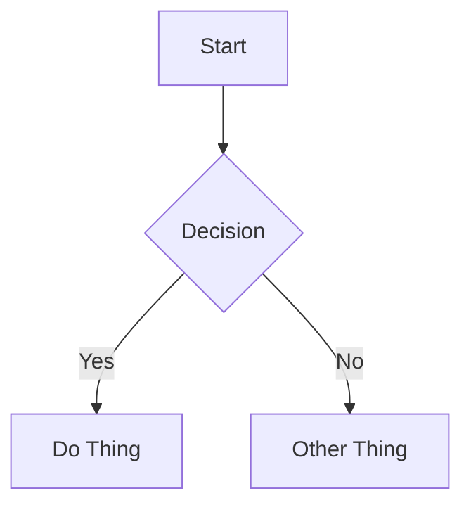

# Jekyll Content Format Reference

## Platform Info

| Property | Value |
|----------|-------|
| Platform | Jekyll |
| Content directory | `_posts/` for published posts, `_drafts/` for drafts |
| Common subdirectories | None within `_posts/` typically — posts go directly in `_posts/` |
| File naming | **DATE PREFIX REQUIRED** — `YYYY-MM-DD-my-post-title.md` (e.g., `2025-01-15-building-a-cli.md`) |
| Frontmatter format | YAML between `---` delimiters |
| Draft behavior | Files in `_drafts/` directory (no date prefix, built only with `--drafts` flag) OR `published: false` in frontmatter |

## Frontmatter

### Required Fields

| Field | Type | Description |
|-------|------|-------------|
| `layout` | string | Page layout template, typically `post` for blog posts. |
| `title` | string | Post title. Displayed as page heading. |

### Optional Fields

| Field | Type | Description |
|-------|------|-------------|
| `date` | datetime | Publication date/time. Overrides filename date if provided. |
| `categories` | list or string | Post categories. Can also be set via directory structure. |
| `tags` | list | Array of tag strings for categorization. |
| `author` | string | Post author name. |
| `description` | string | Short summary. Used in previews and SEO. |
| `excerpt` | string | Custom excerpt text for post listings. |
| `published` | boolean | If `false`, post is excluded from site build. |
| `permalink` | string | Custom permanent URL path for the page. |
| `last_modified_at` | date | Last modified date. Use when updating published posts. |
| `excerpt_separator` | string | Custom separator to define where excerpt ends. |

### Full Example

```yaml
---
layout: post
title: "Building a CLI Tool in Go"
description: "A step-by-step guide to creating your first command-line application with Go."
date: 2025-01-15 14:30:00 -0500
categories:
  - tutorials
  - development
tags:
  - go
  - cli
  - tutorial
author: "Brenna"
published: true
---
```

## Content Features

### Callouts / Admonitions

**NOT natively supported.** Jekyll's default Kramdown renderer does not include callout syntax.

You can use custom CSS classes with Kramdown:

```markdown
> This is a note.
{: .note}
```

However, this requires theme-specific CSS styling. **Do not rely on this working.**

Instead, write important information as:
- Regular emphasized text: `**Important:** This is critical.`
- Standard blockquotes: `> Note: This is helpful context.`

### Code Blocks

**Basic syntax highlighting:**

Jekyll uses Rouge syntax highlighter by default.

````markdown
```python
def hello():
    print("Hello, world!")
```
````

**Title:** NOT supported in fenced code blocks.

**Line highlighting:** NOT supported in fenced code blocks.

**Liquid highlight tag alternative:**

````markdown

def process
  x = calculate
  return x
end

````

The `linenos` option adds line numbers, but individual line highlighting is not supported.

**Recommendation:** Use standard fenced code blocks for simplicity and portability.

### Internal Links

**Standard markdown links:**

```markdown
[Link Text](/blog/other-post/)
```

**Jekyll post_url tag (recommended):**

```markdown
[Link Text]({{ site.baseurl }})
```

The `post_url` tag validates links at build time and prevents broken internal links. Omit the `.md` extension.

**No wikilink support** — Jekyll does not recognize `[[wikilinks]]`.

### Images

**Standard markdown only:**

```markdown

```

**Best practices:**
- Always include alt text
- Use descriptive filenames: `authentication-flow-diagram.png` over `IMG_4523.png`
- Store images in `assets/images/` or `assets/img/` (theme-dependent)
- Images referenced with absolute paths starting with `/` are resolved from site root
- Relative paths work: `` from the post location

**No figure/caption shortcode** — use HTML if captions are needed:

```html
<figure>
  
  <figcaption>Figure 1: User authentication flow</figcaption>
</figure>
```

**No wikilink image syntax** — Jekyll does not support `![[image.png]]`.

### Video Embeds

Use HTML iframes:

```html
<iframe width="560" height="315" src="https://www.youtube.com/embed/VIDEO_ID" title="Video title" frameborder="0" allowfullscreen></iframe>
```

Always add a context sentence before the embed and a fallback link after:

```markdown
[Watch on YouTube](https://www.youtube.com/watch?v=VIDEO_ID)
```

**No built-in shortcodes** for video embeds.

### Diagrams (Mermaid)

**NOT natively supported.** Mermaid diagrams require either:
- The `jekyll-mermaid` plugin (may not be available on GitHub Pages)
- Client-side JavaScript added to your theme

**GitHub Pages limitation:** GitHub Pages uses a restricted plugin allowlist. Mermaid is typically not included.

**If you are unsure about the user's setup, skip Mermaid diagrams entirely.**

If Mermaid is confirmed to be available:

````markdown

````

### Math (LaTeX)

**NOT natively supported.** LaTeX math rendering requires adding MathJax or KaTeX via theme includes or layout files.

If the user has configured MathJax/KaTeX:

Inline: `$E = mc^2$`

Display:

```markdown
$$
\int_{0}^{\infty} e^{-x^2} dx = \frac{\sqrt{\pi}}{2}
$$
```

**If you are unsure about the user's setup, skip LaTeX entirely.**

## Content Structure Best Practices

1. **Start with context** — open with a brief paragraph explaining what the post covers and why it matters.
2. **Use h2 for major sections** — keep the heading hierarchy clean (h2 → h3 → h4).
3. **One idea per paragraph** — keep paragraphs focused and scannable.
4. **Code with context** — explain what code does before or after the block. Always include the language identifier.
5. **Use emphasis sparingly** — bold or blockquotes for important asides, not regular content.
6. **End with a takeaway** — close with a summary, next steps, or a call to action.
7. **Tags and categories for discoverability** — use 2-5 relevant tags and 1-2 categories. Prefer existing tags over creating new ones. Jekyll generates archive pages for each tag and category.
8. **Descriptions matter** — write a compelling 1-2 sentence description for post listings and link previews.
9. **Filename date is canonical** — the date in the filename (`YYYY-MM-DD-`) is the primary publication date. Only override with frontmatter `date` if you need to specify a time or adjust the date.
10. **Excerpt control** — use the `excerpt` frontmatter field or set `excerpt_separator` in your config to control how post previews appear on listing pages.
