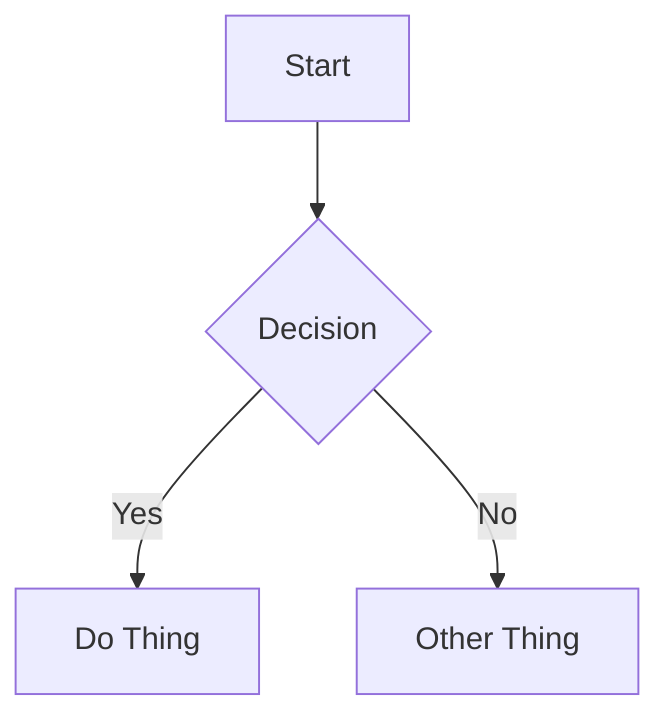

# Quartz Content Format Reference

## Platform Info

| Property | Value |
|----------|-------|
| Platform | Quartz v4 |
| Content directory | `content/` |
| Common subdirectories | Flexible — `blog/`, `notes/`, `projects/`, or flat |
| File naming | Slug: `my-post-title.md` |
| Frontmatter format | YAML between `---` delimiters |
| Draft behavior | `draft: true` — hidden from listings, accessible by direct URL |

## Frontmatter

### Required Fields

| Field | Type | Description |
|-------|------|-------------|
| `title` | string | Post title. Displayed as page heading. |
| `date` | date | Publication date in `YYYY-MM-DD` format. |
| `tags` | list | Array of tag strings for categorization. |

### Optional Fields

| Field | Type | Description |
|-------|------|-------------|
| `description` | string | Short summary (1-2 sentences). Used in previews and SEO. |
| `lastmod` | date | Last modified date. Use when updating published posts. |
| `draft` | boolean | If `true`, hidden from listings but accessible by direct URL. |
| `author` | string | Post author name. |
| `aliases` | list | Alternative URL paths that redirect to this page. |
| `permalink` | string | Custom permanent URL path for the page. |
| `cssclasses` | list | Custom CSS classes applied to the page. |

### Full Example

```yaml
---
title: "Building a CLI Tool in Go"
description: "A step-by-step guide to creating your first command-line application with Go."
date: 2025-01-15
tags:
  - go
  - cli
  - tutorial
draft: false
author: "Brenna"
---
```

## Content Features

### Callouts / Admonitions

Quartz supports callout blocks using the `> [!type]` syntax (Obsidian-compatible).

**Available types:** `note`, `tip`, `warning`, `danger`, `info`, `example`, `question`, `abstract`, `bug`, `quote`

```markdown
> [!note] Title
> Content of the note callout.

> [!tip] Helpful Tip
> Content of the tip callout.

> [!warning] Watch Out
> Content of the warning callout.
```

**Foldable callouts:** Add `+` (expanded by default) or `-` (collapsed by default) after the type:

```markdown
> [!tip]+ Expand Me
> This is expanded by default.

> [!note]- Click to Open
> This is collapsed by default.
```

### Code Blocks

**Basic syntax highlighting:**

````markdown
```python
def hello():
    print("Hello, world!")
```
````

**Title** — add `title="filename"`:

````markdown
```python title="app.py"
def main():
    print("Running app")
```
````

**Line highlighting** — `{N}` or `{N-M}`:

````markdown
```python {2-3}
def process():
    x = calculate()  # highlighted
    return x          # highlighted
```
````

**Word highlighting** — `/word/`:

````markdown
```python /important_function/
result = important_function(data)
```
````

### Internal Links

Quartz supports Obsidian-style wikilinks:

```markdown
[[Other Page Title]]
[[Other Page Title|Display Text]]
[[Other Page Title#Heading|Link to heading]]
```

Standard markdown links also work:

```markdown
[Link Text](/blog/other-post)
```

### Images

**Wikilink syntax (preferred):**

```markdown
![[my-image.png]]
![[my-image.png|Alt text describing the image]]
![[my-image.png|400x300]]
```

Standard markdown syntax also works:

```markdown

```

**Best practices:**
- Always include alt text
- Use descriptive filenames: `authentication-flow-diagram.png` over `IMG_4523.png`
- Prefer local images stored in your media directory
- Specify dimensions when images would render too large: `![[wide-screenshot.png|800x450]]`
- Do NOT place images inside callout blocks — they render inconsistently

### Video Embeds

Use HTML iframes:

```html
<iframe width="560" height="315" src="https://www.youtube.com/embed/VIDEO_ID" title="Video title" frameborder="0" allowfullscreen></iframe>
```

Always add a context sentence before the embed and a fallback link after:

```markdown
[Watch on YouTube](https://www.youtube.com/watch?v=VIDEO_ID)
```

### Diagrams (Mermaid)

**Natively supported.** Quartz renders Mermaid diagrams in fenced code blocks:

````markdown

````

Supports flowcharts, sequence diagrams, class diagrams, state diagrams, gantt charts, and gitgraph.

### Math (LaTeX)

**Natively supported.**

Inline: `$E = mc^2$`

Display:

```markdown
$$
\int_{0}^{\infty} e^{-x^2} dx = \frac{\sqrt{\pi}}{2}
$$
```

## Content Structure Best Practices

1. **Start with context** — open with a brief paragraph explaining what the post covers and why it matters.
2. **Use h2 for major sections** — keep the heading hierarchy clean (h2 → h3 → h4).
3. **One idea per paragraph** — keep paragraphs focused and scannable.
4. **Code with context** — explain what code does before or after the block. Always include the language identifier.
5. **Use callouts sparingly** — most effective for tips, warnings, and important asides, not regular content.
6. **End with a takeaway** — close with a summary, next steps, or a call to action.
7. **Tags for discoverability** — use 2-5 relevant tags. Prefer existing tags over creating new ones.
8. **Descriptions matter** — write a compelling 1-2 sentence description for post listings and link previews.
