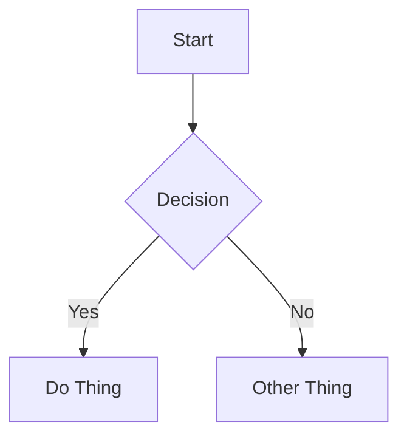

# Zola Content Format Reference

## Platform Info

| Property | Value |
|----------|-------|
| Platform | Zola (Rust-based SSG) |
| Content directory | `content/` |
| Common subdirectories | `blog/`, `posts/` — organized into sections (directories with `_index.md`) |
| File naming | Slug: `my-post-title.md`, or folder: `my-post-title/index.md` for page bundles with co-located assets |
| Frontmatter format | TOML between `+++` delimiters |
| Draft behavior | `draft = true` — excluded from build unless `--drafts` flag used |

## Frontmatter

### Required Fields

| Field | Type | Description |
|-------|------|-------------|
| `title` | string | Post title. Displayed as page heading. |
| `date` | date | Publication date in `YYYY-MM-DD` format. |

### Optional Fields

| Field | Type | Description |
|-------|------|-------------|
| `description` | string | Short summary (1-2 sentences). Used in previews, feeds, and SEO. |
| `updated` | date | Last modified date. Use when updating published posts. |
| `draft` | boolean | If `true`, excluded from build unless `--drafts` flag used. |
| `slug` | string | Custom URL slug for the page. |
| `aliases` | list | Alternative URL paths that redirect to this page. |
| `weight` | number | Sort order for pages in the same section (lower numbers first). |
| `taxonomies` | table | Tags and categories. Define tags and categories under this table. |
| `extra` | table | Free-form table for custom fields like `author`. |

### Minimal Example

```toml
+++
title = "Building a CLI Tool in Go"
date = 2025-01-15

[taxonomies]
tags = ["go", "cli", "tutorial"]
+++
```

### Full Example

```toml
+++
title = "Building a CLI Tool in Go"
date = 2025-01-15
updated = 2025-02-01
description = "A step-by-step guide to creating your first command-line application with Go."
draft = false
slug = "building-cli-go"
aliases = ["/old-url/cli-post"]
weight = 0

[taxonomies]
tags = ["go", "cli", "tutorial"]
categories = ["tutorials"]

[extra]
author = "Brenna"
+++
```

**Important notes:**
- Zola uses **TOML**, not YAML. Frontmatter is delimited by `+++`, not `---`.
- Tags and categories go in a `[taxonomies]` table, not a `tags:` list.
- Custom fields like `author` go in the `[extra]` table, not at the top level.

## Content Features

### Callouts / Admonitions

**NOT natively supported** in base Zola. Some themes provide shortcodes for callouts, but this is not guaranteed.

**Workaround:** Use blockquotes or emphasized text for important content:

```markdown
> **Note:** This is an important piece of information.

**Important:** Always validate user input before processing.
```

Do not use `> [!type]` syntax — it will render as plain text.

### Code Blocks

**Basic syntax highlighting:**

````markdown
```python
def hello():
    print("Hello, world!")
```
````

Zola uses syntect for built-in syntax highlighting (supports most common languages).

**Line numbers** — add `linenos`:

````markdown
```python,linenos
def hello():
    print("Hello, world!")
```
````

**Line highlighting** — add `hl_lines` (1-indexed):

````markdown
```python,hl_lines=2-3
def process():
    x = calculate()  # highlighted
    return x          # highlighted
```
````

**Line number start** — add `linenostart`:

````markdown
```python,linenos,linenostart=10
def process():
    return x
```
````

**Multiple attributes** — comma-separated:

````markdown
```rust,linenos,hl_lines=1 3-5
fn main() {
    let x = 42;
    let y = calculate(x);
    println!("{}", y);
    process(y);
}
```
````

**No title support** in base Zola. If you need a title, add a comment or text above the code block.

### Internal Links

Standard markdown links work:

```markdown
[Link Text](/blog/other-post)
```

**Zola internal links** — use `@/` prefix to reference content directory and validate at build time:

```markdown
[Link to post](@/blog/my-post.md)
[Link to section](@/blog/_index.md)
```

**No wikilink support** — do not use `[[Other Page]]` syntax.

### Images

**Standard markdown:**

```markdown


```

**Co-located images** — place images in the same directory as the post (requires page bundle structure: `my-post/index.md`):

```markdown

```

**Static directory images** — place images in `static/images/` (served at `/images/`):

```markdown

```

**Zola image processing** — use the `resize_image` shortcode for optimized images:

```markdown
{{ resize_image(path="my-image.png", width=800, height=600, op="fit_width") }}
```

**Best practices:**
- Always include alt text
- Use descriptive filenames: `authentication-flow-diagram.png` over `IMG_4523.png`
- Prefer page bundles for posts with multiple images (easier to keep assets together)
- Use `resize_image` shortcode for large images to improve performance
- No wikilink image syntax — use standard markdown or shortcodes

### Video Embeds

Use HTML iframes:

```html
<iframe width="560" height="315" src="https://www.youtube.com/embed/VIDEO_ID" title="Video title" frameborder="0" allowfullscreen></iframe>
```

**Built-in shortcodes:**

```markdown
{{ youtube(id="VIDEO_ID") }}
{{ vimeo(id="VIDEO_ID") }}
```

Always add a context sentence before the embed and a fallback link after:

```markdown
[Watch on YouTube](https://www.youtube.com/watch?v=VIDEO_ID)
```

### Diagrams (Mermaid)

**NOT natively supported.** Requires client-side JavaScript or a custom shortcode.

If your Zola site has Mermaid set up via theme or custom template, use standard fenced code blocks:

````markdown

````

**If unsure whether Mermaid is configured, skip diagrams** or use images instead.

### Math (LaTeX)

**NOT natively supported.** Requires adding KaTeX or MathJax via template modification.

If your Zola site has math rendering configured, use standard LaTeX syntax:

Inline: `$E = mc^2$`

Display:

```markdown
$$
\int_{0}^{\infty} e^{-x^2} dx = \frac{\sqrt{\pi}}{2}
$$
```

**If unsure whether math is configured, avoid LaTeX** or include fallback text/images.

## Content Structure Best Practices

1. **Start with context** — open with a brief paragraph explaining what the post covers and why it matters.
2. **Use h2 for major sections** — keep the heading hierarchy clean (h2 → h3 → h4).
3. **One idea per paragraph** — keep paragraphs focused and scannable.
4. **Code with context** — explain what code does before or after the block. Always include the language identifier.
5. **Use emphasis sparingly** — bold and blockquotes are effective for important asides, but most content should be regular text.
6. **End with a takeaway** — close with a summary, next steps, or a call to action.
7. **Tags for discoverability** — use 2-5 relevant tags in `[taxonomies]`. Prefer existing tags over creating new ones.
8. **Descriptions matter** — write a compelling 1-2 sentence description for feeds, link previews, and SEO.
9. **Organize with sections** — Zola uses sections (directories with `_index.md`) to structure content. Each section can have its own template and configuration.
10. **Use page bundles for asset-heavy posts** — if a post has multiple images or files, use the `my-post/index.md` structure to co-locate assets.
