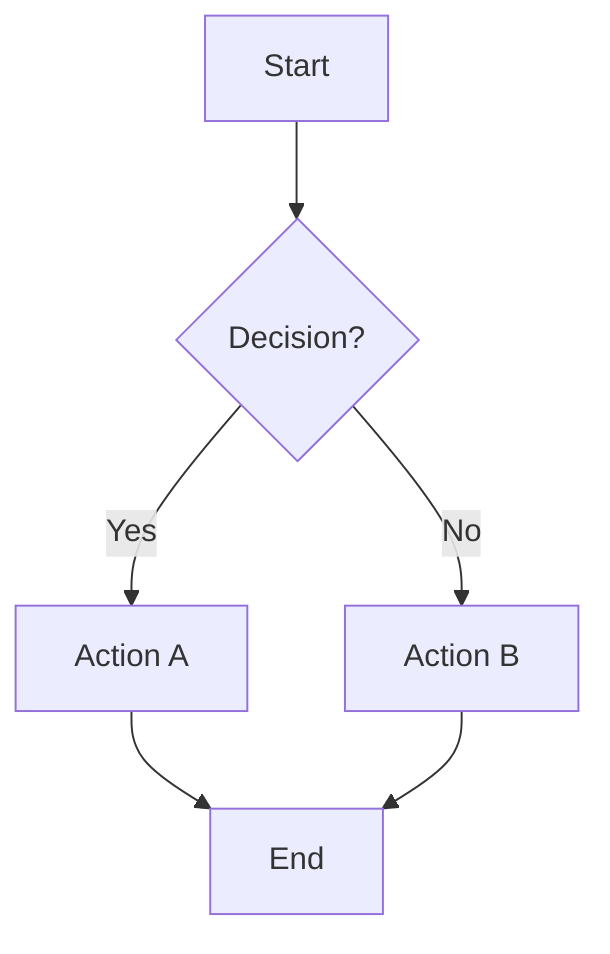
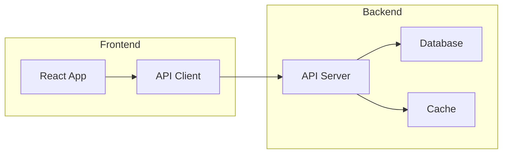
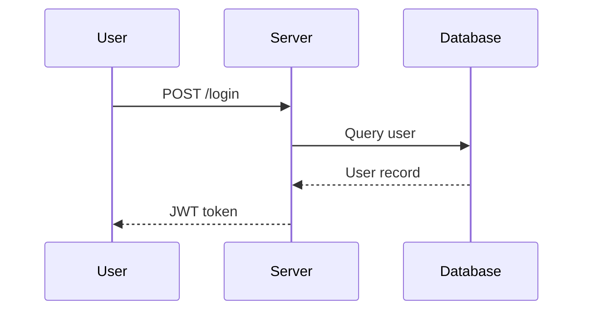
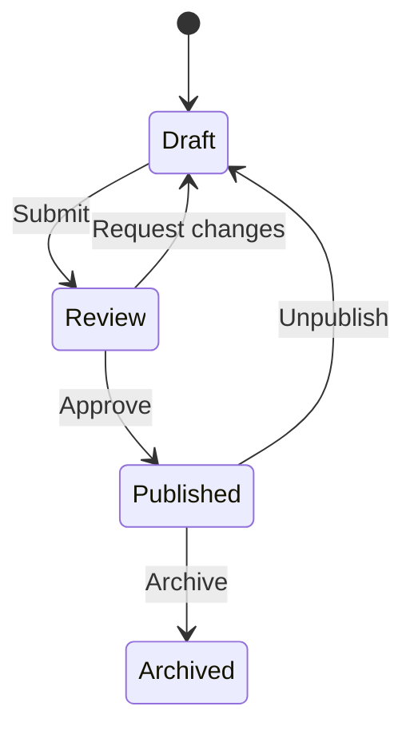
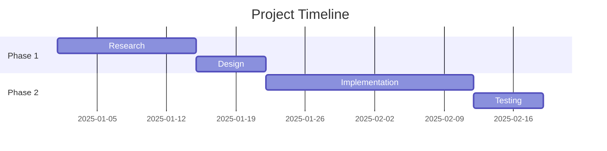

# Media Guide Reference

How to identify visual opportunities in blog posts and add appropriate media.

## Visual Opportunity Detection

Scan post content for these patterns and suggest the matching diagram type:

| Content Pattern | Suggested Visual | Mermaid Type |
|----------------|-----------------|-------------|
| Step-by-step process, workflow, pipeline | Flowchart | `graph TD` or `graph LR` |
| Request/response flow, API calls, service communication | Sequence diagram | `sequenceDiagram` |
| Object relationships, data models, class hierarchies | Class diagram | `classDiagram` |
| Lifecycle, modes, transitions between states | State diagram | `stateDiagram-v2` |
| Timeline, project phases, milestones | Gantt chart | `gantt` |
| Decision tree, conditional logic, branching paths | Flowchart with decisions | `graph TD` with `{}` nodes |
| Before/after comparisons | Side-by-side table or two diagrams | — |
| Architecture, system components, infrastructure | Flowchart with subgraphs | `graph TD` + `subgraph` |
| Data flow, ETL, event processing | Flowchart | `graph LR` |
| Git branching strategy | Gitgraph | `gitGraph` |

## Image Candidates vs Diagram Candidates

### Use a Mermaid diagram when:
- The content describes a **process, flow, or relationship** that can be expressed as nodes and edges
- The information is **abstract or structural** — architecture, workflows, state machines
- You want the visual to stay **in sync with the text** (diagrams are code, easy to update)
- The visual needs to be **precise** — exact steps, exact relationships

### Use an image when:
- The content references something **visual by nature** — a UI, a physical thing, a screenshot, a result
- A photo or illustration would convey **more than a diagram** — before/after screenshots, product photos
- The concept is **better shown than diagrammed** — a design, a layout, a real-world example

### Use a table when:
- Comparing **2-4 options** across the same dimensions
- Listing **structured data** — feature comparisons, config options, API parameters
- The comparison is **simple enough** that a diagram would overcomplicate it

## Content That Does NOT Need Visuals

Skip suggesting visuals for:

- **Short opinion pieces** — personal takes, hot takes, reflections under 500 words
- **Simple code tutorials** — the code itself is the visual; adding a flowchart of a 5-line function adds noise
- **Lists and roundups** — "5 tools I use" doesn't need a diagram connecting them
- **Code examples that are self-explanatory** — well-commented code with clear variable names
- **Single-concept posts** — if the entire post explains one thing linearly, a diagram may just restate the text

## Mermaid Syntax Quick Reference

### Flowchart

````markdown

````

### Flowchart with Subgraphs (Architecture)

````markdown

````

### Sequence Diagram

````markdown

````

### State Diagram

````markdown

````

### Gantt Chart

````markdown

````

## File Naming Conventions

### Rules
- Use **kebab-case**: `authentication-flow-diagram.png`
- Be **descriptive**: prefer `user-login-sequence.png` over `diagram1.png`
- Include **content type** when helpful: `api-architecture.svg`, `dashboard-screenshot.png`
- Rename generic camera/device filenames: `IMG_4523.png` → `deployment-pipeline-whiteboard.png`

### Supported Formats

| Format | Best For | Notes |
|--------|----------|-------|
| PNG | Screenshots, diagrams with text | Lossless, wide support |
| JPG | Photos, images with gradients | Lossy but smaller file size |
| GIF | Short animations, demos | Keep under 5MB |
| SVG | Diagrams, icons, logos | Scales perfectly, smallest file size |
| WebP | General purpose | Modern format, good compression |

## Alt Text Guidelines

Alt text should describe the **content and purpose** of the image, not its format.

### Good Alt Text
- "Architecture diagram showing three microservices connected through a message queue"
- "Before and after screenshots of the redesigned dashboard"
- "Terminal output showing successful deployment to production"
- "Flowchart of the user registration process with email verification"

### Bad Alt Text
- "Image" / "Screenshot" / "Diagram"
- "image1.png"
- "A picture of a thing"
- "Click to enlarge"

### Rules
- **Concise but complete** — one sentence, rarely two
- **Describe content, not format** — "authentication flow" not "flowchart"
- **Include key details** — if a screenshot shows an error message, mention the error
- **Skip decorative images** — if an image is purely decorative, use empty alt: `![[divider.png|]]`

## Media Placement Rules

### Where to place visuals

- **After the text that introduces the concept** — the reader should understand what they're about to see
- **Before detailed explanation** — a diagram can serve as a map before diving into specifics
- **At natural section breaks** — between major topics or at the start of a new section
- **Near the data they illustrate** — a chart should be close to the numbers it visualizes

### Where NOT to place visuals

- **At the very top of the post** — the opening paragraph should set context first
- **Back-to-back** — two consecutive images/diagrams without text between them feels like a slideshow
- **Inside callouts** — images in `> [!tip]` blocks render inconsistently
- **After "Mentioned in this post"** — the references section is the end; nothing goes after it
- **In the middle of a paragraph** — break the paragraph at a natural point and place the image between
