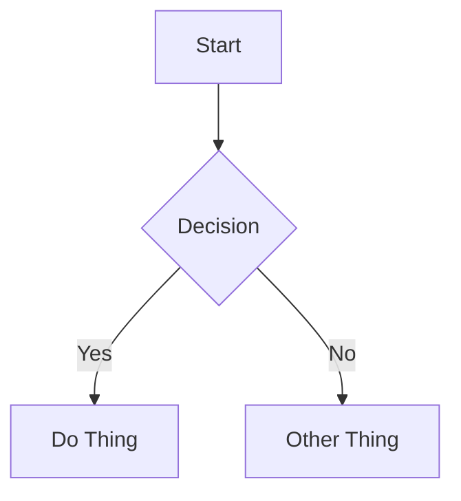

# Quartz Content Format Reference

This reference covers the content format for Quartz v4 static sites.

## Frontmatter

Quartz uses YAML frontmatter at the top of markdown files. Wrap with `---` delimiters.

### Required Fields

```yaml
---
title: "Post Title Here"
date: 2025-01-15
tags:
  - programming
  - tutorial
---
```

### All Supported Fields

| Field | Type | Description |
|-------|------|-------------|
| `title` | string | Post title. Displayed as page heading. |
| `description` | string | Short summary (1-2 sentences). Used in previews and SEO. |
| `date` | date | Publication date in `YYYY-MM-DD` format. |
| `lastmod` | date | Last modified date. Use when updating existing posts. |
| `tags` | list | Array of tag strings for categorization. |
| `draft` | boolean | If `true`, post is hidden from listings but accessible by direct URL. |
| `author` | string | Post author name. |
| `aliases` | list | Alternative URL paths that redirect to this page. |
| `permalink` | string | Custom permanent URL path for the page. |
| `cssclasses` | list | Custom CSS classes applied to the page. |

### Frontmatter Example

```yaml
---
title: "Building a CLI Tool in Go"
description: "A step-by-step guide to creating your first command-line application with Go."
date: 2025-01-15
tags:
  - go
  - cli
  - tutorial
draft: false
author: "Brenna"
---
```

## Callouts

Quartz supports callout blocks for highlighting information. Use the `> [!type]` syntax.

### Available Types

```markdown
> [!note] Title
> Content of the note callout.

> [!tip] Helpful Tip
> Content of the tip callout.

> [!warning] Watch Out
> Content of the warning callout.

> [!danger] Critical
> Content of the danger callout.

> [!info] For Reference
> Content of the info callout.

> [!example] Example
> Content of the example callout.

> [!question] FAQ
> Content of the question callout.

> [!abstract] Summary
> Content of the abstract/summary callout.

> [!bug] Known Issue
> Content of the bug callout.

> [!quote] Citation
> Content of the quote callout.
```

### Foldable Callouts

Add `+` (expanded by default) or `-` (collapsed by default) after the type:

```markdown
> [!tip]+ Expand Me
> This is expanded by default.

> [!note]- Click to Open
> This is collapsed by default.
```

## Code Blocks

### Basic Syntax Highlighting

Use triple backticks with a language identifier:

````markdown
```python
def hello():
    print("Hello, world!")
```
````

### Code Block Title

Add a title with `title="filename"`:

````markdown
```python title="app.py"
def main():
    print("Running app")
```
````

### Line Highlighting

Highlight specific lines with `{N}` or ranges `{N-M}`:

````markdown
```python {2-3}
def process():
    x = calculate()  # highlighted
    return x          # highlighted
```
````

### Word Highlighting

Highlight specific words or phrases:

````markdown
```python /important_function/
result = important_function(data)
```
````

## Links

### Wikilinks

Quartz supports Obsidian-style wikilinks for internal linking:

```markdown
[[Other Page Title]]
[[Other Page Title|Display Text]]
[[Other Page Title#Heading|Link to heading]]
```

### Standard Markdown Links

```markdown
[Link Text](https://example.com)
[Internal Link](/blog/other-post)
```

## Mermaid Diagrams

Quartz renders Mermaid diagrams in fenced code blocks:

````markdown

````

Supports flowcharts, sequence diagrams, class diagrams, state diagrams, and more.

## LaTeX Math

### Inline Math

```markdown
The formula $E = mc^2$ is well known.
```

### Display Math

```markdown
$$
\int_{0}^{\infty} e^{-x^2} dx = \frac{\sqrt{\pi}}{2}
$$
```

## Content Structure Best Practices

1. **Start with context**: Open with a brief paragraph explaining what the post covers and why it matters.
2. **Use h2 for major sections**: Keep the heading hierarchy clean — h2 for main sections, h3 for subsections.
3. **One idea per paragraph**: Keep paragraphs focused and scannable.
4. **Code with context**: Always explain what code does before or after the block. Include the language identifier.
5. **Use callouts sparingly**: They're most effective for tips, warnings, and important asides — not for regular content.
6. **End with a takeaway**: Close with a summary, next steps, or a call to action.
7. **Tags for discoverability**: Use 2-5 relevant tags. Prefer existing tags over creating new ones to keep the tag namespace clean.
8. **Descriptions matter**: Write a compelling 1-2 sentence description — it appears in post listings and link previews.
